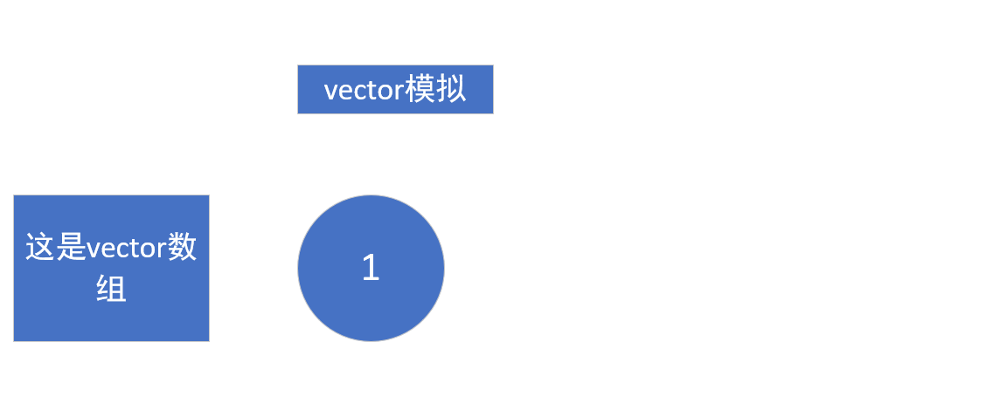
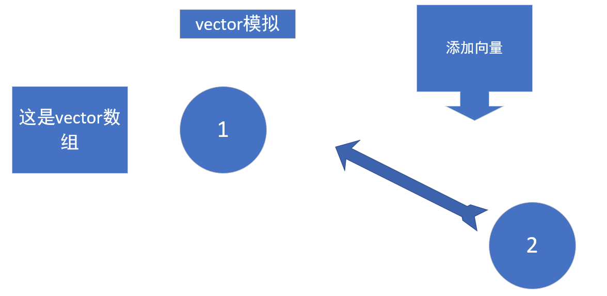
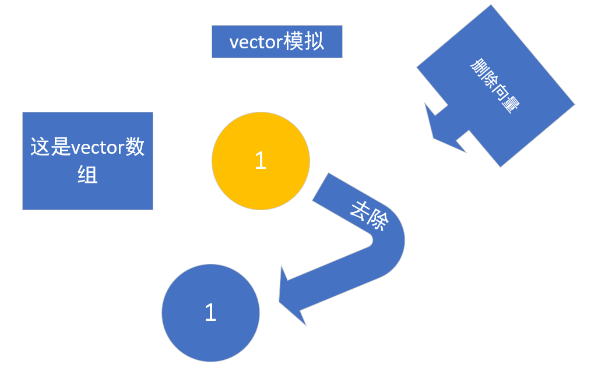
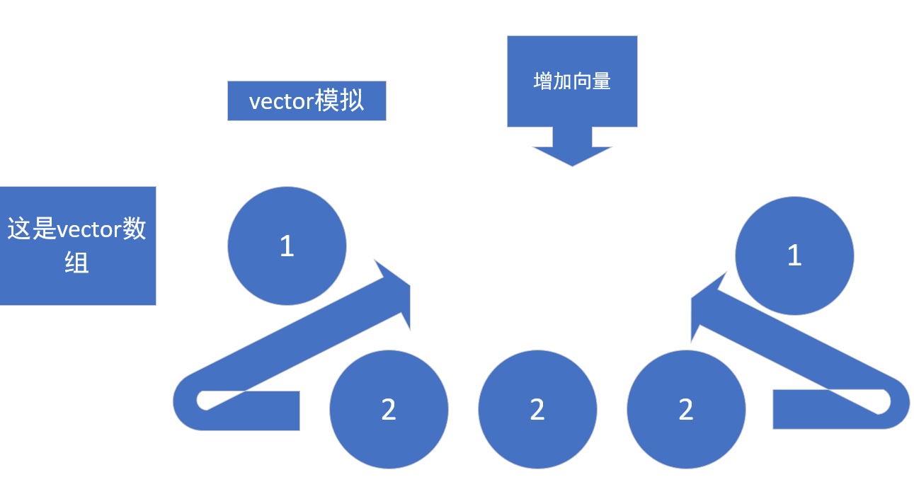

# STL-Learning
STL学习的部分总结

# Vector STL简要介绍


 > 关于STL中的vector容器，以下做一些相关介绍。

#### vector 简要概述

 >- vector 称作向量类，属于容器类，实现了动态的数组，用于元素数量变化的对象数组。简单来说，vector 也可以当作普通数组去使用，配合 vector 中的迭代器，能够更好管理其中的内容。

 >- vector 类下标也从 0 开始，与普通数组不同的是，每当使用 push_back 增加内容的时候，其对象元素个数大小会增大，当使用 erase 释放元素的时候，其对象元素个数大小会减少

 >- 接下来，便会介绍部分 vector 中的函数，以便于让读者了解 vector 容器的用法

---

####  首先 vector 容器，是这样定义的
     vector<int> pos;
     //此定义了一个整型的空的 vector 容器，名称为pos

     vector<int>::iterator iterpos;
     //此定义了一个整型的迭代器，名称为iterpos

     下面，介绍 vector 中的构造函数
     
      - vector()
     //这是创建一个空的 vector 容器
     exanple : vector<int> pos();

     - vector(int nSize)
     //这是创建一个包含nSize个数的vector容器
     exanple : vector<int> pos( nSize );
     
     - vector(int nSize, const T& t)
     //创建一个大小为 nSize，初值为 t 的vector容器
     exanple : vector<int> pos( nSize, t );

     - vector(const vector& )
     //从另一个 vector 中复制该 vector 容器
     exanple : vector<int> pos1( pos2 );
     ( pos2为整型的vector容器 )

---

#### 其次 vector 容器中，存在增加，删除，以及其他用途的函数

- 首先，我们来讲一下增加函数

> void push_back(const T& x);
    
    此函数是向向量后边添加一个元素，其用法为
    pos.push_back(3);
    pos为vector申请的一维的一个容器，向后边推进的数据为3

> iterator insert(iterator it, const T & x);

    此函数是向容器中的某一元素前添加x元素，iterator为迭代器，相当于vector中使用的指针

> void insert(iterator it, int n, const T& x);

    向容器中的某一元素前增加相同的元素x，增加的数量为n个

> void insert(iterator it, const_iterator first, const_iterator last);

    该元素是向向量中的某一元素it前插入另一个相同类型向量的[ first, last )间的数据。

- 其次，我们来讲一下删除函数
> iterator erase(iterator it);

    删除向量中的某一元素，利用迭代器，定位到vector容器中的位置，从而删除该元素。

> iterator erase(iterator first, iterator last);

    删除向量中[first, last)中的元素，利用迭代器，定位两个位置。
    然后调用函数，从而删除该容器从first到last中的元素。

> void clear();

    此函数是删除向量/容器中的所有元素，为程序结束时，调用释放内存


- 再者，我们来讲一下 vector 中的其他函数

> bool empty() const;

    此函数为判空函数，判断该向量/容器是否为空，如果为空，返回true，如果是非空，返回false（布尔值）

> void swap(vector &);

    此函数为交换两个同类型向量的数据


---
> vector 可以用来动态申请二维数组，类似功能和二维数组调用类似，以下便是一个简短的例子

```C++

#include<iostream>
#include<cstdlib>
#include<vector>
using namespace std;

//函数声明
void _Arry(vector<vector<int>>& arry, int line, int column);

int main()
{
	int column, line;
	cin >> line >> column;
    
     //在此地方，声明了以为数组arry，有line个
	vector< vector < int > > arry(line);

     //此地方，用申请来的arry数组，再次申请空间，申请column个，resize分配空间，创建对象
	for (int i = 0; i < line; i++)
		arry[i].resize(column);

	_Arry(arry, line, column);
	
     //清理申请来的空间，如何申请便如何清理
	for (int i = 0; i < line; i++)
		arry[i].clear();
	arry.clear();

	return 0;
}

//调用函数调用申请的二维数组
void _Arry(vector<vector<int>>&arry,int line,int column)
{
	for (int i = 0; i < line; i++)
		for (int j = 0; j < column; j++)
			arry[i][j] = 8;

	for (int i = 0; i < line; i++)
	{
		for (int j = 0; j < column; j++)
			cout << arry[i][j] << " ";
		cout << endl;
	}
}

```

---

部分图示如下：

### 向量本身



### 添加向量



### 删除向量



### 添加同一类型的多个向量




---

<div class="footer">

   😊借鉴《C++ STL基础与应用》一书

</div>


